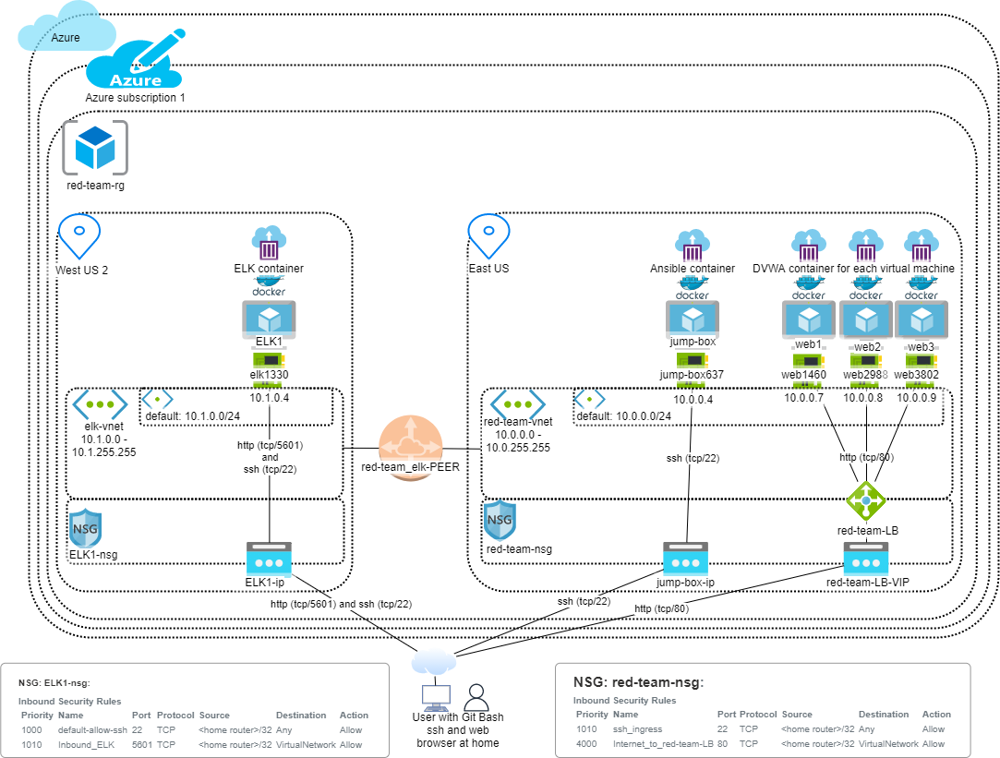
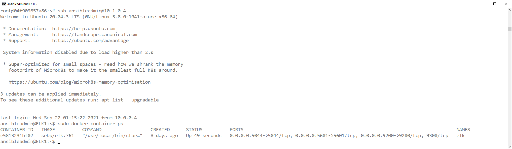

## Automated ELK Stack Deployment

The files in this repository were used to configure the network depicted below.

These files have been tested and used to generate a live ELK deployment on Azure. They can be used to either recreate the entire deployment pictured above. Alternatively, select portions of the *Ansible Playbook ???* file may be used to install only certain pieces of it, such as Filebeat.

  - _TODO: Enter the playbook file._

This document contains the following details:
- Description of the Topologu
- Access Policies
- ELK Configuration
  - Beats in Use
  - Machines Being Monitored
- How to Use the Ansible Build

### Description of the Topology

The main purpose of this network is to expose a load-balanced and monitored instance of DVWA, the D*mn Vulnerable Web Application.

Load balancing ensures that the application will be highly *available*, in addition to restricting *access* to the network.
- _TODO: What aspect of security do load balancers protect?
  - Answer: Availability

- What is the advantage of a jump box?
  - Answer: Reduced attack surface due to only one entry point for management.

Integrating an ELK server allows users to easily monitor the vulnerable VMs for changes to the *application ???* and system *configuration ???*.
- TODO: What does Filebeat watch for?
  - Answer: Filebeat watches for changes to files, typically text files.

- TODO: What does Metricbeat record?
  - Metricbeat records ativity within the operating system or hardware such as processor or memory or storage utilization.

The configuration details of each machine may be found below.
_Note: Use the [Markdown Table Generator](http://www.tablesgenerator.com/markdown_tables) to add/remove values from the table_.

| Name     | Function                                   | IP Address | Operating System     |
|----------|--------------------------------------------|------------|----------------------|
| jump-box | Gateway                                    | 10.0.0.4   | Linux (ubuntu 20.04) |
| web1     | DVWA web server                            | 10.0.0.7   | Linux (ubuntu 20.04  |
| web2     | DVWA web server                            | 10.0.0.8   | Linux (ubuntu 20.04) |
| web3     | DVWA web server                            | 10.0.0.9   | Linux (ubuntu 20.04) |
| ELK1     | ELK (ElasticSearch Logstash Kibana) server | 10.1.0.4   | Linux (ubuntu 20.04) |

### Access Policies

The machines on the internal network are not exposed to the public Internet. 

Only the *jump-box* machine can accept connections from the Internet. Access to this machine is only allowed from the following IP addresses:
- _TODO: Add whitelisted IP addresses_
  - Answer: You are probably expecting an IPv4 address here. Instead, for security reasons, all I will say is that the output from "what is my ipv4 address" in Chrome running on my home PC will be used here.

Machines within the network can only be accessed by *jump-box*.
- TODO: _Which machine did you allow to access your ELK VM?_
  - Answer: jump-box via ssh and  \<home router public IP> ???

- TODO: _What was its IP address?_
  - Answer: 10.0.0.4

A summary of the access policies in place can be found in the table below.

| Name     | Publicly Accessible | Allowed IP Addresses |
|----------|---------------------|----------------------|
| Jump Box | Yes                 |  \<home router public IP>        |
| web1     | No                  |  10.0.0.4 ??? |
| web2     | No                  |  10.0.0.4 ??? |
| web3     | No                  |  10.0.0.4 ??? |
| ELK1     | Yes                 | 10.0.0.4, \<home router public IP> |

### Elk Configuration

Ansible was used to automate configuration of the ELK machine. No configuration was performed manually, which is advantageous because...
- _TODO: What is the main advantage of automating configuration with Ansible?_
  - Answer: Repeatability.

The playbook implements the following tasks:
- _TODO: In 3-5 bullets, explain the steps of the ELK installation play. E.g., install Docker; download image; etc._
  - Set vm.max_map_count to 256 MB
  - Install docker
  - Install Python
  - Download and launch ELK container
  - Enable docker service

The following screenshot displays the result of running `docker ps` after successfully configuring the ELK instance.

### Target Machines & Beats
This ELK server is configured to monitor the following machines:
- _TODO: List the IP addresses of the machines you are monitoring_
  - Answer: 10.0.0.7, 10.0.0.8, 10.0.0.9

We have installed the following Beats on these machines:
- _TODO: Specify which Beats you successfully installed_
  - Answer: filebeat and metric beat

These Beats allow us to collect the following information from each machine:
- _TODO: In 1-2 sentences, explain what kind of data each beat collects, and provide 1 example of what you expect to see. E.g., `Winlogbeat` collects Windows logs, which we use to track user logon events, etc._
  - Answer: "Beats is a free and open platform for single-purpose data shippers. They send data from hundreds or thousands of machines and systems to Logstash or Elasticsearch." https://www.elastic.co/beats/
    - filebeat: " Filebeat helps you keep the simple things simple by offering a lightweight way to forward and centralize logs and files." https://www.elastic.co/beats/filebeat
    - metricbeat: "Metricbeat is a lightweight way to send system and service statistics." https://www.elastic.co/beats/metricbeat

### Using the Playbook
In order to use the playbook, you will need to have an Ansible control node already configured. Assuming you have such a control node provisioned: 

SSH into the control node and follow the steps below:
- _Copy the *id_rsa.pub* file to *each managed node, i.e. web server (web1, web2 and web3)???*._
- _Update the */etc/ansible/ansible.cfg* file to include..._
  - Answer:
    - remote_user=ansibleadmin # uncomment this line, same user associated with *id_rsa.pub* above.

- _Update the */etc/ansible/hosts* file to include..._
  - Answer:
    - '[webservers] # uncomment this line'
    - '10.0.0.7 ansible_python_interpreter=/usr/bin/python3'
    - '10.0.0.8 ansible_python_interpreter=/usr/bin/python3'
    - '10.0.0.9 ansible_python_interpreter=/usr/bin/python3'

- Run the playbook, and navigate to *each managed node, i.e. web server (web1, web2 and web3)???* to check that the installation worked as expected.

_TODO: Answer the following questions to fill in the blanks:_
- _Which file is the playbook?_
  - Answer:
    - /etc/ansible/playbooks/pentest.yml # used to install DVWA on web servers
    - /etc/ansible/playbooks/install-elk.yml # used to install ELK on ELK1 server

- _Where do you copy it?_
  - Answer:
    - /etc/ansible/playbooks

- _Which file do you update to make Ansible run the playbook on a specific machine?_
  - Answer:
    - /etc/ansible/hosts

- _How do I specify which machine to install the ELK server on versus which to install Filebeat on?_
  - Answer:
    - Edit /etc/ansible/hosts
    - Add these lines:
    - '[elk]'
    - '10.1.0.4 ansible_python_interpreter=/usr/bin/python3'

- _Which URL do you navigate to in order to check that the ELK server is running?_
  - Answer:

_As a **Bonus**, provide the specific commands the user will need to run to download the playbook, update the files, etc._
  - Answer:
